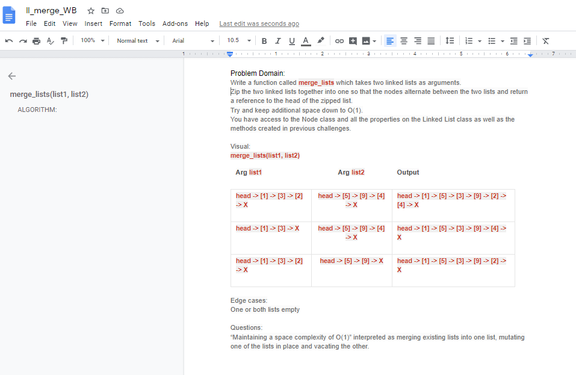
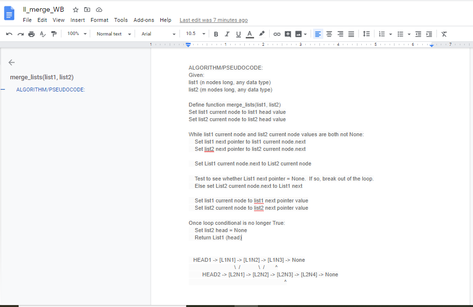

# Merge two singly linked lists
Given two singly linked lists, merge them in place "zipper fashion" into one list.

## Challenge Description
1. Write a function called merge_lists which takes two linked lists as arguments. Zip the two linked lists together into one so that the nodes alternate between the two lists and return a reference to the head of the zipped list. 
1. Try and keep additional space down to O(1). 
1. You have access to the Node class and all the properties on the Linked List class as well as the methods created in previous challenges.

## Approach & Efficiency
Big O space for this approach is O(1)  
Big O time for this approach is O(n)  

My code is [here](./ll_merge.py)

## Solution

## ATTRIBUTIONS:
Many thanks to Skyler Burger and James Salamonsen for helping me dig out of the 'import' maze!

 

#### Checklist:

 - [X] Top-level README “Table of Contents” is updated
 - [X] Feature tasks for this challenge are completed
 - [ ] Unit tests written and passing
     - [X] “Happy Path” - Expected outcome
     - [X] Expected failure
     - [X] Edge Case (if applicable/obvious)
 - [X] README for this challenge is complete
     - [X] Summary, Description, Approach & Efficiency, Solution
     - [X] Link to code
     - [X] Picture of whiteboard

###### Submission PR:  https://github.com/vorSherer/Py-DSnA/pull/27
