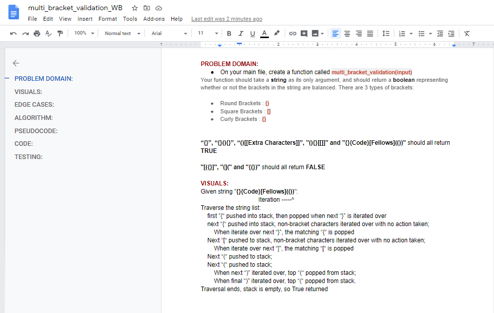
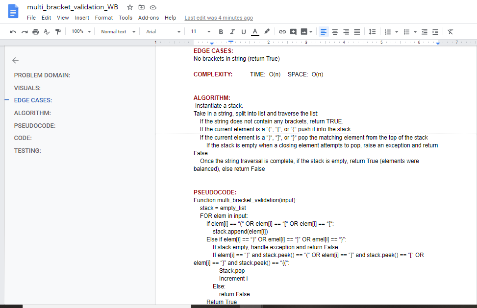
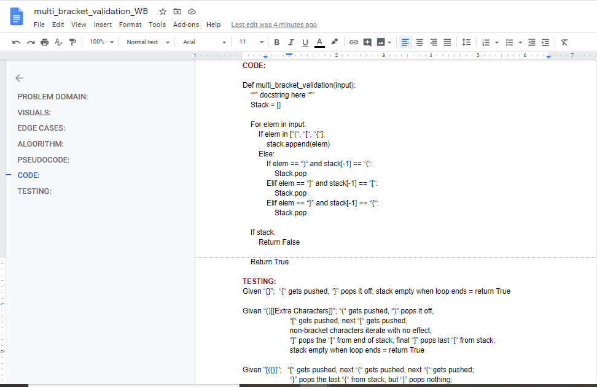
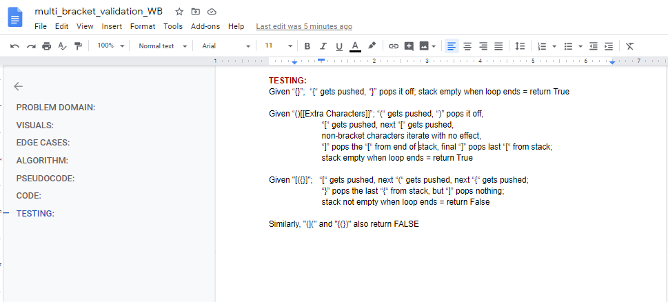

# Multi-bracket Validation
Given a string input, test to see whether any "brackets" (i.e., parentheses, square or curly brackets) it contains are correctly matched (each opening "bracket" is met with a corresponding closing "bracket" before a non-matching closing "bracket" is encountered) and return a boolean result.

## Challenge Description
Write a function called multi_bracket_validation which take a string as its only argument, and should return a boolean representing whether or not the brackets in the string are balanced. There are 3 types of brackets:
Round Brackets : ()
Square Brackets : []
Curly Brackets : {}

## Approach & Efficiency
I decided upon an iterative approach to traverse the string.  

Big O space for this approach is O(n)  
Big O time for this approach is O(n)  

## Solution

[My Code is here.](./multi_bracket_validation.py)

## Task Checklist:  
- [X] Top-level README “Table of Contents” is updated  
- [ ] Feature tasks for this challenge are completed  
- [ ] Unit tests written and passing  
    - [ ] “Happy Path” - Expected outcome  
    - [ ] Expected failure  
    - [ ] Edge Case (if applicable/obvious)  
- [X] README for this challenge is complete  
    - [X] Summary, Description, Approach & Efficiency, Solution  
    - [X] Link to code  
    - [X] Pictures of whiteboard  

## Collaboration and Attribution

###### Submission PR: NN