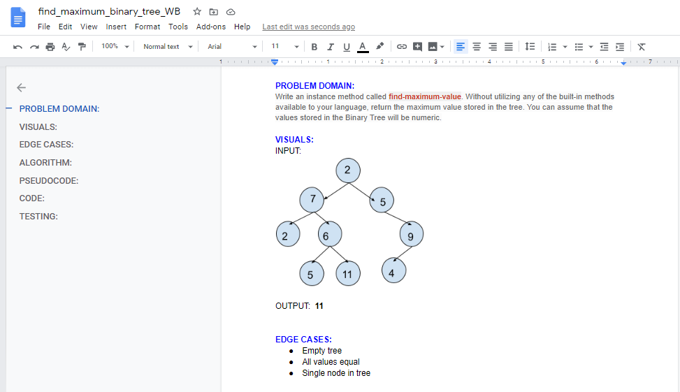
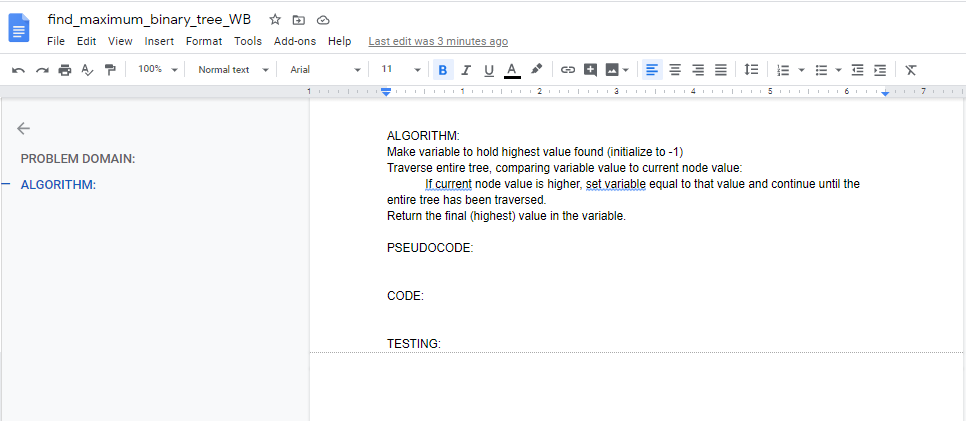

# Find the Maximum Value in a Binary Tree

## Challenge Description
Write an instance method called __`find-maximum-value`__. Without utilizing any of the built-in methods available to your language, return the maximum value stored in the tree. You can assume that the values stored in the __Binary Tree__ will be numeric.  

## Approach & Efficiency
__Big O space complexity__ for this approach is __`O(1)`__  
__Big O time complexity__ for this approach is __`O(n)`__  

My code is [here]()

## Solution

## ATTRIBUTIONS:
<!-- Many thanks to Skyler Burger and James Salamonsen for helping me dig out of the 'import' maze! -->

 

#### Checklist:

 - [ ] Top-level README “Table of Contents” is updated
 - [ ] Feature tasks for this challenge are completed
 - [ ] Unit tests written and passing
     - [ ] “Happy Path” - Expected outcome
     - [ ] Expected failure
     - [ ] Edge Case (if applicable/obvious)
 - [ ] README for this challenge is complete
     - [ ] Summary, Description, Approach & Efficiency, Solution
     - [ ] Link to code
     - [ ] Picture of whiteboard

###### Submission PR:  

