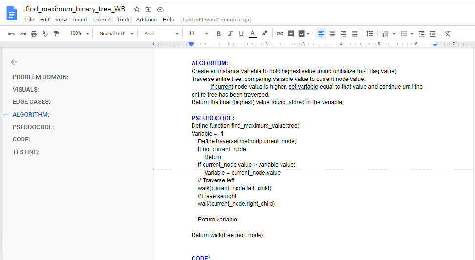
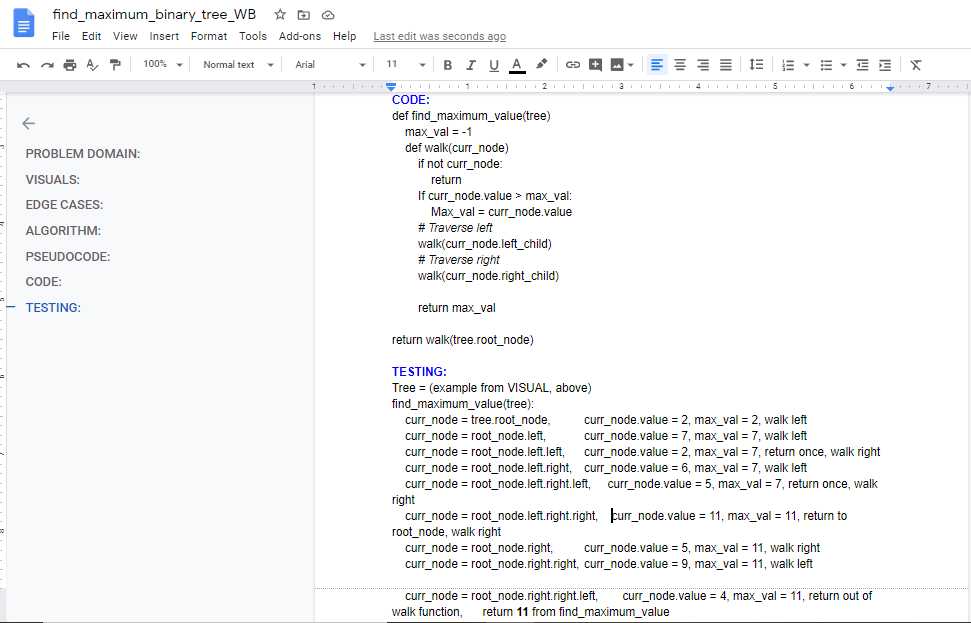

# Find the Maximum Value in a Binary Tree

## Challenge Description
Write an instance method called __`find-maximum-value`__. Without utilizing any of the built-in methods available to your language, return the maximum value stored in the tree. You can assume that the values stored in the __Binary Tree__ will be numeric.  

## Approach & Efficiency
Utilize the __Call Stack__ for the traversal method:

__Big O space complexity__ for this approach is __`O(1)`__  
__Big O time complexity__ for this approach is __`O(n)`__  

My code is [here](./find_max_value.py)

## Solution

## ATTRIBUTIONS:
__Skyler Burger__ helped with debugging code for failed test.
 

#### Checklist:

 - [X] Top-level README “Table of Contents” is updated
 - [X] Feature tasks for this challenge are completed
 - [X] Unit tests written and passing
     - [X] “Happy Path” - Expected outcome
     - [X] Expected failure
     - [X] Edge Case (if applicable/obvious)
 - [X] README for this challenge is complete
     - [X] Summary, Description, Approach & Efficiency, Solution
     - [X] Link to code
     - [X] Pictures of whiteboard

###### Submission PR:  
