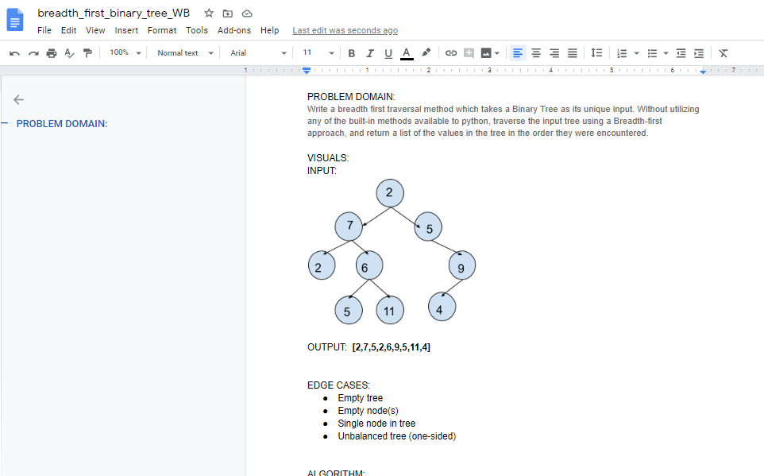

# Breadth-first traversal of a Binary Tree

## Challenge Description
Write a __breadth-first traversal__ method which takes a __Binary Tree__ as its unique input. Without utilizing any of the built-in methods available to your language, traverse the input tree using a Breadth-first approach, and __*return a list of the values in the tree in the order they were encountered*__.  

## Approach & Efficiency
Utilize a __queue__ structure for the traversal:

__Big O space complexity__ for this approach is __`O(1)`__  
__Big O time complexity__ for this approach is __`O(n)`__  

My code is [here](./breadth_first_traversal.py)

## Solution

## ATTRIBUTIONS:

 

#### Checklist:

 - [X] Top-level README “Table of Contents” is updated
 - [ ] Feature tasks for this challenge are completed
 - [ ] Unit tests written and passing
     - [ ] “Happy Path” - Expected outcome
     - [ ] Expected failure
     - [ ] Edge Case (if applicable/obvious)
 - [ ] README for this challenge is complete
     - [ ] Summary, Description, Approach & Efficiency, Solution
     - [X] Link to code
     - [ ] Picture of whiteboard

###### Submission PR:  
