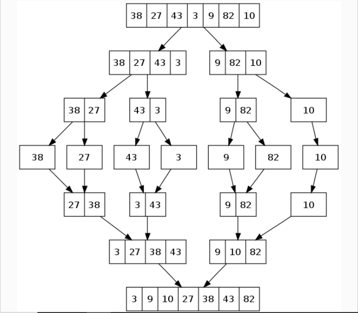

# Code Challenge 29:
# Interview 01
Implement __Mergesort__.

## Specifications
- Read all of the following instructions carefully.
- Act as an interviewer, giving a candidate a code challenge
- Score the candidate according to the Whiteboard Rubric
- You are free to offer suggestions or guidance (and see how they respond), but don’t solve it for the candidate  

## Feature Tasks
- Ask the candidate to write a function to implement a mergesort.
- Avoid utilizing any of the built-in methods available in your language.
- Offer an example input array of positive and negative integers.
- Encourage a recursive solution, for elegance. Iterative solutions are possible.
- The candidate should have at least 2 functions—traditionally, a __`mergesort`__ and a __`merge`__ function.
- The candidate should be able to describe the properties of the algorithm they implement:  
	- Is it in-place?  
		- Most likley not.  
	- Is it stable? 
		- Most likely, depends on implementation.
	- Is it adaptable?
		- Most likely, depends on implementation.
	- What’s the time and space complexity?
		- This is a divide-and-conquer algorithm, so it takes __`O(n log n)`__ time — that's __`n`__ steps to merge arrays __`log n`__ times.
		- Since at any given time, it only ever needs __`n`__ elements stored in arrays to merge, it uses __`O(n)`__ space.  

## Structure
Familiarize yourself with the grading rubric, so you know how to score the interview.

Look for effective problem solving, efficient use of time, and effective communication with the whiteboard space available.

Every solution might look a little different, but the candidate should be able to test their solution with different inputs to verify correctness.

Assign points for each item on the Rubric, according to how well the candidate executed on that skill.

Add up all the points at the end, and record the total at the bottom of the page.

## Example

## Documentation
Record detailed notes on the rubric, to share with the candidate when the interview is complete.  

Whiteboard rubric on me [here](./assets/2020-08-31_cc_29_WB-Rubric.png)  
